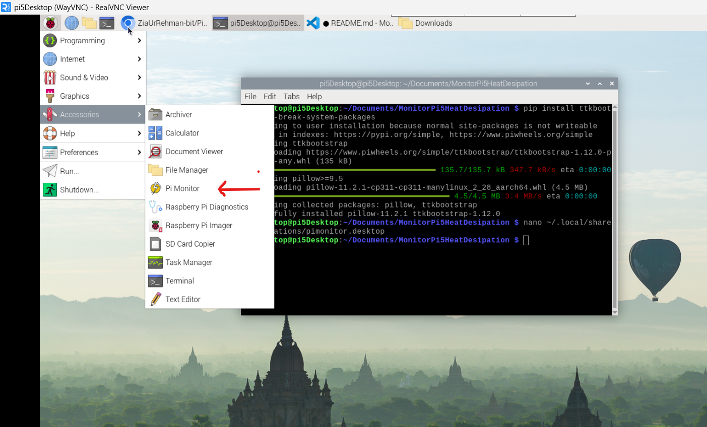
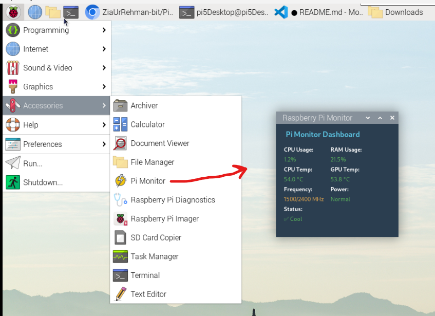

# Pi Monitor – Real-Time Raspberry Pi System Dashboard


<!--  -->

A lightweight, real-time system monitoring dashboard built with Python and `ttkbootstrap` for Raspberry Pi devices. Displays **CPU/RAM usage**, **temperatures**, **clock frequency**, and **power status** in a beautifully styled GUI.

---

## Features

- **Live CPU and RAM usage**
- **CPU and GPU temperatures**
- **Power throttling & under-voltage detection**
- **CPU frequency monitoring**
- **Modern GUI with Superhero Dark Theme**
- **Optional application menu entry with icon**

---

## Screenshot




---

## Dependencies

Make sure Python 3 is installed, and run:

```bash
pip install psutil ttkbootstrap
```
### Run the GUI

```bash
python GUI3.py
```
## Add to Application Menu with Icon

To make the GUI accessible from your desktop environment like a native app:

### 1. Create a `.desktop` Entry

```bash
nano ~/.local/share/applications/pimonitor.desktop
```
### 2. Paste the Following

```bash
[Desktop Entry]
Type=Application
Name=Pi Monitor
Exec=python3 /home/pi/your_folder/monitor.py
Icon=/home/pi/your_folder/icon.png
Terminal=false
Categories=Utility;
```
Replace /home/pi/your_folder/ with your actual file path.